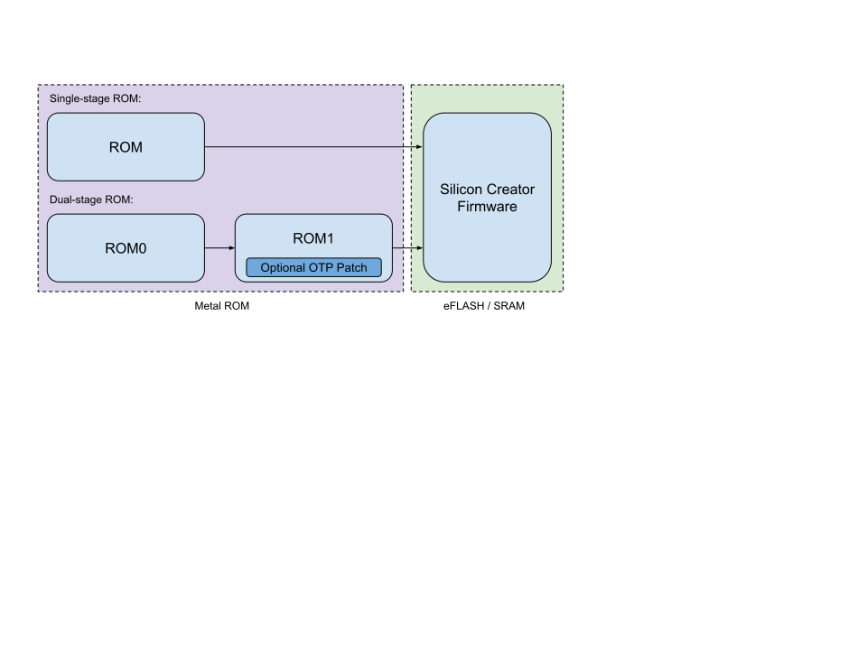

# Pavona ROM

The ROM is the first software that executes after a device reset, and also serves as the first boot stage in the Pavona Secure Boot implementation.
ROM software is programmed into the chip's metal ROM during wafer manufacturing and cannot be changed.

Top-level designs may be configured using either a single- or a dual-stage ROM.
The Egret discrete reference design uses a single-stage ROM, and the Dragonfly integrated reference design uses a dual-stage ROM.
In a dual-stage ROM, the second stage ROM (ROM1) supports an optional patch loaded to OTP that is signed by the Silicon Creator and verified by the first-stage (ROM0).

The purpose of the ROM is to initialize a set of critical hardware blocks and verify that the loaded silicon creator firmware is allowed to be executed on the chip.

# References

- [Secure Boot Specification](../../../../doc/security/specs/secure_boot/README.md)
- [Mask ROM Specification](doc/rom_overview_specification.md)
- [Manifest Format](../rom_ext/doc/manifest.md)
- [Root Keys](doc/root_keys.md)
- [Signature Verification](doc/sigverify.md)
- [ROM End-End Regression Setup](doc/e2e_tests.md)
- [Test Plan](data/rom_e2e_testplan.hjson)
